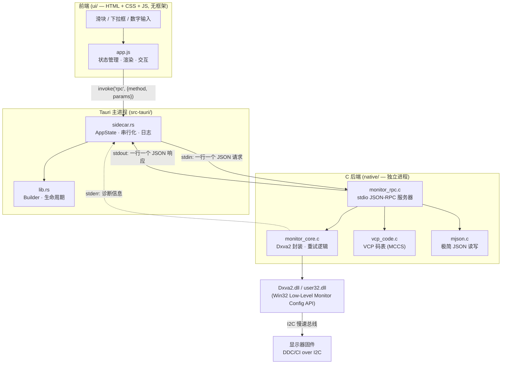

# MonitorCtrl

用 **Tauri 2 + C** 重写的 Windows 显示器控制工具。通过 DDC/CI (VESA MCCS) 协议直接读写显示器的亮度、对比度、色彩、输入源等硬件参数。

原项目 [`dot-osk/monitor_ctrl`](https://github.com/dot-osk/monitor_ctrl) 是 Python + tkinter, 本仓库把它完整移植成了**原生 C 后端 + 现代 Web 前端**的桌面应用。

> **下载**: [Releases](https://github.com/TongenShen/monitor-ctrl-tauri/releases/latest) 里有编译好的
> NSIS 安装包 (约 1.5 MB)，双击即可安装，无需管理员权限。

---

## 目录

- [快速开始](#快速开始)
- [为什么这样分层](#为什么这样分层)
- [架构](#架构)
- [从原项目到新项目的映射](#从原项目到新项目的映射)
- [功能清单](#功能清单)
- [构建前提](#构建前提)
- [构建与运行](#构建与运行)
- [JSON-RPC 协议参考](#json-rpc-协议参考)
- [两个硬件坑 (重要)](#两个硬件坑-重要)
- [常见问题](#常见问题)
- [目录结构](#目录结构)
- [当前状态](#当前状态)
- [许可](#许可)

---

## 快速开始

### 普通用户 (直接安装)

1. 取安装包 `MonitorCtrl_1.0.0_x64-setup.exe`
   (位于 `src-tauri/target/release/bundle/nsis/`, 约 1.5 MB)
2. 双击安装 —— **按当前用户安装, 不需要管理员权限**
3. 启动「MonitorCtrl」

**运行要求**: Windows 10 1809+ 或 Windows 11, 且系统已安装 WebView2 Runtime
(Win11 和较新的 Win10 已内置, 缺失时安装包会自动下载)。

### 开发者 (从源码跑)

```powershell
cd monitor_ctrl_tauri
cd native; .\build.bat; cd ..   # 1) 编译 C 后端
npm install                     # 2) 装 Tauri CLI
npm run dev                     # 3) 开发模式启动
```

完整流程见 [构建与运行](#构建与运行)。

### 前置条件 (两个都容易忽略)

- **只支持外接显示器**。笔记本内屏、虚拟显示器, 以及部分 KVM / 视频采集卡
  不透传 DDC/CI, 会被识别为"不支持"。
- **显示器 OSD 菜单里的 DDC/CI 必须是开启的** —— 很多显示器出厂默认关闭,
  这种情况下所有属性都会读不到。

---

## 为什么这样分层

| 决策 | 理由 |
| --- | --- |
| **C 做后端** | DDC/CI 最终要调 `Dxva2.dll` 的 Win32 API, C 直接 `#include` 头文件链接即可, 零运行时依赖, 单文件 92 KB |
| **Tauri 而不是 Electron** | 复用系统 WebView2, 安装包 ~3 MB 而非 ~150 MB, 内存占用低一个数量级 |
| **后端做成 sidecar 子进程** | 见下 |
| **stdio + 行分隔 JSON** 作为 IPC | 见下 |

### 为什么后端要单独一个进程

1. **DDC/CI 是慢速 I2C 总线, 必须串行化。**
   一次读写要几十到几百毫秒。如果并发下发指令, 显示器固件会返回校验和错误甚至直接不响应。
   stdin/stdout 天然就是一个**单通道串行队列** —— 一次只有一条请求在飞, 不需要任何锁, 也不会有竞态。

2. **崩溃隔离。**
   显示器驱动是内核态的, 某些 KVM / 采集卡 / 虚拟显示器会让 `Dxva2` 调用卡死或异常。
   放子进程里, 崩了只是后端掉线, 前端可以弹个"重试"按钮重启它, 而不是整个应用消失。

3. **绕开 FFI 所有权问题。**
   如果 C 代码编成 `.dll` 用 Rust 的 `extern "C"` 调, 就要手工管理内存所有权、字符串生命周期、错误码转换, 还容易踩到 ABI 不匹配。
   走管道的话 C 侧只需要会读写文本行, Rust 侧只需要会发 JSON, 边界极清晰。

4. **无端口、无防火墙弹窗、无网络暴露。**
   不是本地 socket, 也不是 HTTP —— 只是父子进程之间的一对匿名管道。

> **代价**: 前端无法直接调硬件, 所有操作都要经过一次 JSON 序列化。对每秒几次的 UI 交互来说完全无感。

---

## 架构



**数据流**: 用户拖动滑块 → `app.js` 只在**松手时**调一次 `invoke` → Rust 把请求写进子进程 stdin → C 解析后调 `Dxva2` → 显示器响应 → C 把结果写 stdout → Rust 读一行返回给前端 → 前端更新 UI。

**stderr 只用于日志**, 会被 Rust 侧转发并打上 `[monitor_rpc]` 前缀, 永远不混进 JSON 流。

---

## 从原项目到新项目的映射

| 原 `monitor_ctrl` (Python) | 新项目 | 说明 |
| --- | --- | --- |
| `vcp.py` → `class PhyMonitor` | `native/monitor_core.c` + `.h` | Dxva2 调用、caps 解析、属性读写 |
| `vcp_code.py` (VCP 码表) | `native/vcp_code.c` + `.h` | MCCS 码表 + 枚举表 + 名称查找 |
| `tkui.py` (tkinter/ttk) | `ui/index.html` + `style.css` + `app.js` | 全新深色 UI, 无框架 |
| `monitor_ctrl.py` (argparse CLI) | `native/monitor_rpc.c` (JSON-RPC) | CLI 换成进程间协议 |
| 进程内直接 `setattr` | **新增** Rust sidecar 层 | 跨进程串行化 + 崩溃隔离 |
| — | `native/mjson.c` | 自写的极简 JSON 库, 避免引入 cJSON |

---

## 功能清单

### 读取 (`get_props`)

| 属性 | VCP 码 | 说明 |
| --- | --- | --- |
| `brightness` / `brightness_max` | `0x10` | 亮度 |
| `contrast` / `contrast_max` | `0x12` | 对比度 |
| `rgb_gain` / `rgb_gain_max` | `0x16/0x18/0x1A` | RGB 三通道增益 |
| `color_temperature` | `0x0C` | 色温 (开尔文), 由 `3000 + 当前值 × 步进` 换算 |
| `color_preset` | `0x14` | 颜色预设 (sRGB / 4000K / 6500K / User Mode…) |
| `osd_language` | `0xCC` | OSD 菜单语言 |
| `power_mode` | `0xD6` | 电源模式 (on / off) |
| `input_src` | `0x60` | 输入源 (DisplayPort 2 / HDMI 1…) |

任何显示器不支持的字段返回 JSON `null`, 对应的枚举列表返回 `[]`, 前端会优雅降级 (禁用控件 + 提示)。

### 读取 (`get_info`)

`model` · `description` · `display_type` · `poweron_hours` (`0xC0` 累计开机时长) · `panel_type` (`0xB2` 面板像素排列) · `caps` (完整 DDC/CI 能力字符串)

### 写入 (`set_prop`)

亮度、对比度、RGB 增益 (一次发三个通道)、色温、颜色预设、OSD 语言、电源模式、输入源, 以及一个通用逃生口 `vcp:<VCP名>` 可以写任意 VCP 码。

> **EEPROM 保护**: 前端在提交前会比对当前值, **值没变就不下发**。颜色预设和 OSD 语言写在显示器 EEPROM 里, 反复写会磨损, 这个检查沿用了原 Python 版的逻辑。

### 动作 (`action`)

- `auto_setup` — 自动调整 (对应 `0x1E` Auto Setup)
- `reset_factory` — 恢复出厂设置 (对应 `0x04`, 前端会先弹确认框)

### 其他

- 多显示器枚举与切换 (侧栏列表)
- 操作日志 (写入类操作全部留痕, 含时间戳和成功/失败)
- 后端状态指示灯 + 一键重启后端
- 热插拔后重新枚举显示器 (F5)
- 前后端全程 UTF-8, 中文显示器描述 / caps 字符串不乱码

---

## 构建前提

| 依赖 | 版本 | 用途 | 备注 |
| --- | --- | --- | --- |
| **MinGW-w64 GCC** | 16.x | 编译 C 后端 | 自带 `libdxva2.a` 和 Dxva2 头文件, **不需要 Windows SDK** |
| **Rust** (rustup) | 1.77+ | 编译 Tauri 主进程 | 需要 `x86_64-pc-windows-msvc` target |
| **MSVC Build Tools** | VS 2019+ | Rust 的链接器 | 装 "使用 C++ 的桌面开发" 工作负载 |
| **Node.js** | 18+ | 前端构建 / Tauri CLI | 只是工具链, 运行时不依赖 |
| **WebView2 Runtime** | 任意 | Tauri 渲染 | Win11 和较新的 Win10 已内置 |
| Python 3 | 3.x | 仅用于生成图标 / 测试脚本 | 可选 |

> C 后端**不依赖 MSVC** —— 只用 MinGW 就能编出 `monitor_rpc.exe`。
> MSVC 只是给 Rust 当链接器用。

---

## 构建与运行

```powershell
cd monitor_ctrl_tauri

# 1) 编译 C 后端 (产出 native/monitor_rpc.exe)
cd native; .\build.bat; cd ..

# 2) 安装前端工具链
npm install

# 3) 把 exe 复制成带目标三元组后缀的名字 (Tauri externalBin 的要求)
npm run sidecar

# 4) 开发模式运行 (会自动先跑 sidecar 再起 tauri dev)
npm run dev

# 5) 打包成 NSIS 安装包 (产出 src-tauri/target/release/bundle/nsis/*.exe)
npm run build
```

`package.json` 里的脚本:

| 脚本 | 实际命令 |
| --- | --- |
| `npm run native` | `cd native && build.bat` |
| `npm run sidecar` | `node scripts/stage-sidecar.mjs` |
| `npm run dev` | `npm run sidecar && tauri dev` |
| `npm run build` | `npm run sidecar && tauri build` |

### 单独测试 C 后端

后端不依赖任何前端, 可以单独跑冒烟测试:

```powershell
cd native
python test_rpc.py            # 自动测试: ping / 枚举 / 读属性 / 边界情况
python test_rpc.py --write    # 额外测一次亮度写入往返
python test_rpc.py -i         # 交互模式, 手工敲 JSON 请求
```

### 重新生成图标

```powershell
python scripts\make-icon.py   # 纯标准库 (os/struct/zlib), 不需要 Pillow
```

---

## JSON-RPC 协议参考

**传输**: 一行一个 JSON 对象。请求写 stdin, 响应读 stdout。
**编码**: UTF-8, 行尾 `\n` (两端都强制二进制模式, 不做 CRLF 转换)。
**日志**: 一律走 stderr。

### 请求格式

```json
{"id": 1, "method": "get_props", "index": 0}
```

### 响应格式

```json
{"id": 1, "ok": true, "result": { ... }}
{"id": 1, "ok": false, "error": "读取 VCP 0x10 失败"}
```

`id` 由客户端自增, 服务端原样回传。客户端会校验 id 是否匹配。

### 方法一览

#### `ping`

```json
→ {"id":1,"method":"ping"}
← {"id":1,"ok":true,"result":{"pong":"1"}}
```

#### `list_monitors`

```json
→ {"id":2,"method":"list_monitors"}
← {"id":2,"ok":true,"result":{"monitors":[
     {"index":0,"model":"Generic PnP Monitor","description":"Generic PnP Monitor"}
   ]}}
```

#### `get_props`

```json
→ {"id":3,"method":"get_props","index":0}
← {"id":3,"ok":true,"result":{
     "brightness": 60,
     "brightness_max": 100,
     "contrast": 75,
     "contrast_max": 100,
     "rgb_gain": [50, 50, 50],
     "rgb_gain_max": 100,
     "color_temperature": 3050,
     "color_preset": "6500K",
     "color_preset_list": ["sRGB","Display Native","4000K","5000K","6500K","7500K","9300K","User Mode 1","User Mode 2","User Mode 3"],
     "osd_language": "Chinese-simplified",
     "osd_languages_list": ["English","Chinese-simplified","Chinese-traditional","French","German","Italian","Japanese","Korean","Russian","Spanish"],
     "power_mode": "on",
     "power_mode_list": ["on","off"],
     "input_src": "DisplayPort 2",
     "input_src_list": ["Analog video (R/G/B) 1","Analog video (R/G/B) 2","Digital video (TMDS) 1","Digital video (TMDS) 2","Composite video 1","Composite video 2","S-Video 1","S-Video 2","DisplayPort 1","DisplayPort 2","HDMI 1","HDMI 2"]
   }}
```

不支持的属性是 `null`, 不支持的列表是 `[]`。

#### `get_info`

```json
→ {"id":4,"method":"get_info","index":0}
← {"id":4,"ok":true,"result":{
     "model": "Generic PnP Monitor",
     "description": "Generic PnP Monitor",
     "display_type": "lcd",
     "poweron_hours": 866,
     "panel_type": "Red / Green / Blue vertical stripe",
     "caps": "prot(monitor)type(lcd)MStarcmds(01 02 03 07 0C E3 F3)vcp(02 04 05 08 10 12 14(04 05 08 0B) 16 18 1A 52 60( 11 12 0F 10) 62 AA(01 02) AC AE B2 B6 C6 C8 C9 D6(01 04 05)CC(02 0D) DF FD)mccs_ver(2.1)mswhql(1)"
   }}
```

#### `enum_tables`

一次性拿到所有枚举表, 避免逐字段请求:

```json
→ {"id":5,"method":"enum_tables","index":0}
← {"id":5,"ok":true,"result":{
     "color_preset_list": [...],
     "osd_languages_list": [...],
     "power_mode_list": [...],
     "input_src_list": [...]
   }}
```

**`index` 会按该显示器的 caps string 过滤结果**, 详见下一节。

#### 枚举表按 caps string 过滤 (重要)

原始的 `monitor_ctrl.py` / `tkui.py` 把 VESA MCCS 的**全集**塞进下拉框: 18 个输入源
(含 Tuner / Composite / S-Video)、38 种 OSD 语言、13 种颜色预设。但显示器实际只支持
其中一小部分 —— 用户在下拉框里选了 HDMI 1, 结果必然是报错。

正确做法是解析显示器自己上报的 caps string。它的 `vcp(...)` 段落形如:

```
vcp(02 04 05 08 10 12 14(04 05 08 0B) 16 18 1A 52 60( 11 12 0F 10) 62 AA(01 02) ... D6(01 04 05)CC(02 0D) DF FD)
```

规则:

| caps 里的形态 | 含义 | 本项目的处理 |
| --- | --- | --- |
| `14(04 05 08 0B)` | 支持 VCP 0x14, 且取值限定为 0x04 / 0x05 / 0x08 / 0x0B | 只保留这 4 个 |
| `16` | 支持 VCP 0x16, 但不限定取值 | 保留全集 |
| 完全找不到该 VCP 码 | 不支持 | 返回 `[]`, 前端禁用该控件 |
| 显示器没打开 / 拿不到 caps | 无法判断 | 退回全集 (保证界面至少能渲染) |

以本机为例, 过滤后的效果:

| 表 | 全集 | 过滤后 |
| --- | --- | --- |
| 输入源 (`0x60`) | 18 项 | `DisplayPort 1` / `DisplayPort 2` / `HDMI 1` / `HDMI 2` |
| OSD 语言 (`0xCC`) | 38 项 | `English` / `Chinese-simplified` |
| 颜色预设 (`0x14`) | 13 项 | `5000K` / `6500K` / `9300K` / `User Mode 1` |
| 电源模式 (`0xD6`) | 2 项 | `on` / `off` |

解析在 `monitor_core.c` 的 `caps_find_vcp_values()` 里, 有两个容易踩的坑:

1. **枚举表可能紧贴前一个 VCP 的右括号**, 中间没有空格:
   `D6(01 04 05)CC(02 0D)` 里的 `CC` 前一个字符是 `)`, 不是空格。
   所以判断前导符时不能只认空格和 `(`。
2. **不能直接用 `strstr` 比较两位十六进制值**:
   在 `"020D"` 里找 `"20"` 会命中第 2 个字符, 于是 `Serbian`(0x20) 被误判为支持。
   必须按 2 字符对齐逐对比较。

另外, 这段搜索必须限制在 `vcp(...)` 段落内 (用括号配对找到它的右括号),
否则 `cmds(01 02 03 07 0C E3 F3)` 里的 `02` / `0C` 也会被误命中。

> `get_props` 的返回值里**已经内嵌**了过滤后的这 4 个列表,
> 所以渲染控制面板只需要一次 `get_props`, 不用再单独调 `enum_tables`。

#### `set_prop`

```json
→ {"id":6,"method":"set_prop","index":0,"prop":"brightness","value":80}
← {"id":6,"ok":true,"result":{"prop":"brightness","status":"ok"}}
```

`prop` → `value` 类型:

| `prop` | `value` 类型 | 例子 |
| --- | --- | --- |
| `brightness` / `contrast` / `color_temperature` | 整数 | `80` / `4200` |
| `rgb_gain` | 三元整数数组 | `[60,55,50]` |
| `color_preset` / `osd_language` / `power_mode` / `input_src` | 字符串 | `"6500K"` |
| `vcp:<VCP 名>` | 整数 | `"vcp:Luminance"` → `80` |

`vcp:` 前缀是通用逃生口, 可以直接写码表里的任意 VCP 名 (如 `vcp:Restore Factory Defaults`)。

#### `action`

```json
→ {"id":7,"method":"action","index":0,"action":"auto_setup"}
← {"id":7,"ok":true,"result":{"action":"auto_setup","status":"ok"}}
```

`action` 取值: `auto_setup` | `reset_factory`

#### `shutdown`

```json
→ {"id":8,"method":"shutdown"}
← {"id":8,"ok":true,"result":{"status":"bye"}}
```

### Tauri 命令 (前端 → Rust)

前端通过 `invoke()` 调这些命令, 它们再转成上面的 JSON-RPC:

| 命令 | 参数 | 返回 |
| --- | --- | --- |
| `rpc` | `{method, params}` | 后端 `result` 对象 |
| `rpc_batch` | `{calls: [{key, method, params}]}` | `{key: {ok, result \| error}}` |
| `enum_tables` | `{index}` | 四个枚举表的合集 (已按 caps 过滤) |
| `backend_status` | — | `{running: bool}` |
| `restart_backend` | — | 新后端的 exe 路径 |
| `get_log` | — | `[{time, level, message}]` |
| `clear_log` | — | `null` |

`AppState::rpc` **在整次调用期间持有互斥锁**, 这是 DDC/CI 串行化保证的落点。

### 错误码 (C 侧 `MonResult`)

| 值 | 名称 | 含义 |
| --- | --- | --- |
| 0 | `MON_OK` | 成功 |
| -1 | `MON_ERR_ARG` | 参数非法 |
| -2 | `MON_ERR_NO_MONITOR` | 找不到该索引的显示器 |
| -3 | `MON_ERR_OPEN` | 打开物理显示器句柄失败 |
| -4 | `MON_ERR_CAPS` | 读取能力字符串失败 |
| -5 | `MON_ERR_VCP` | 读写 VCP 失败 (通常是 I2C 校验和错误) |
| -6 | `MON_ERR_RANGE` | 值超出范围 |
| -7 | `MON_ERR_UNSUPPORTED` | 显示器不支持该属性 |
| -8 | `MON_ERR_NOMEM` | 内存不足 |

前端 `friendlyError()` 会把 `MON_ERR_*` 翻译成中文提示。

---

## 两个硬件坑 (重要)

### 1. `hPhysicalMonitor` 可能是 `0`, 但 DDC/CI 照样能用

`GetPhysicalMonitorsFromHMONITOR` 返回的 `PHYSICAL_MONITOR.hPhysicalMonitor` 在本机上就是 `0`。
如果按直觉写 `if (handle == NULL) return ERROR;` 就会**误判成"打不开显示器"**, 所有属性读出来都是 `null`。

更反直觉的是: `GetCapabilitiesStringLength(NULL, &len)` **居然能成功**。

> **结论**: 永远不要用 `hPhysicalMonitor` 是否为 0 来判断有效性。原 Python 版从来不检查这个值, 所以它是对的。
> 本项目的 `mon_send_vcp` / `mon_read_vcp` 里所有 `handle != NULL` 的检查都已移除, `mon_close()` 也无条件调 `DestroyPhysicalMonitor` (传 0 是安全的空操作)。

### 2. DDC/CI 的 I2C 读取**天然会间歇失败**

实测原 Python 版连续读 8 次 caps, **只有 7 次成功**, 失败时抛 `OSError [WinError -1071241845]` (校验和错误)。

这不是 bug, 是 I2C 总线的物理特性 —— 显示器固件响应慢、时序抖动、总线噪声都会导致校验和失败。

> **结论**: 每一次收发都要重试。本项目在 `monitor_core.c` 里加了:
> ```c
> #define MON_RETRY_TIMES   3
> #define MON_RETRY_DELAY_MS 15
> ```
> `mon_send_vcp` / `mon_read_vcp` / 两次 caps 调用都套了重试循环。
> **实测效果: 连续 5 次运行全部成功** —— 比原 Python 版更稳。

---

## 常见问题

**Q: 提示"未检测到显示器"或所有属性都是空的**

按顺序排查:

1. 显示器 OSD 菜单里找 `DDC/CI` 或 `DDC/CI Support`, 确认是 **On**。这是最常见的原因。
2. 换一根线或换一个接口试 —— 部分廉价 HDMI 转接器只走视频, 不透传 DDC/CI 的 I2C 通道。
3. 中间是否有 KVM / 切换器 / 采集卡? 这类设备经常直接掐断 DDC/CI。
4. 笔记本内屏不支持, 必须接外接显示器。
5. 点一下标题栏的刷新按钮重试 —— I2C 偶发失败很常见 (见上文硬件坑 2)。

**Q: 提示"读取显示器能力字符串失败 (DDC/CI 通信不稳定, 可重试)"**

同上第 5 条。这是 I2C 校验和失败, 点「重试」通常一次就过。后端内部已经重试 3 次, 仍然失败才会上报。

**Q: 后端状态显示"未连接"**

C 后端子进程没起来。点一下状态灯或按 F5 重启后端。若一直失败, 说明安装不完整 ——
`monitor_rpc.exe` 应位于安装目录下 (和主程序同级)。

**Q: 下拉框里没有我要的选项**

这是**故意的**。项目会解析显示器上报的 caps string, 只列出它真正声明支持的取值
(见 [枚举表按 caps string 过滤](#枚举表按-caps-string-过滤-重要))。
如果你的显示器确实支持某项但 caps 里没声明, 那是显示器固件的问题, 可以用 `set_prop`
的 `vcp:<VCP名>` 逃生口强行下发。

**Q: 为什么拖动滑块的时候画面不跟着变?**

这是刻意设计。DDC/CI 一次读写要几十到几百毫秒, 拖动过程中连续下发会把 I2C 总线打爆,
显示器固件会开始返回校验和错误。所以**只在松手 (pointerup) 时下发一次**。
数字会实时跟着滑块变, 但硬件是在松手那一刻才改。

**Q: 会不会把显示器写坏?**

颜色预设和 OSD 语言存在显示器 EEPROM 里, 反复写会磨损。所以前端在提交前会比对当前值,
**值没变就不下发**。这个保护逻辑是从原 Python 版继承的。

**Q: 支持笔记本内屏 / 虚拟显示器吗?**

不支持。Dxva2 的 Low-Level Monitor Configuration API 只能操作走 DDC/CI 的物理显示器。

**Q: 打包出来的 exe 为什么这么小 (1.5 MB)?**

因为复用了系统自带的 WebView2, 不像 Electron 那样把整个 Chromium 塞进安装包。

---

## 目录结构

```
monitor_ctrl_tauri/
├── native/                     # C 后端 (独立可执行文件)
│   ├── monitor_rpc.c           #   stdio JSON-RPC 服务器 (main)
│   ├── monitor_core.c/.h       #   Dxva2 封装 + 重试逻辑
│   ├── vcp_code.c/.h           #   VESA MCCS VCP 码表
│   ├── mjson.c/.h              #   极简 JSON 读写
│   ├── test_rpc.py             #   冒烟测试 / 交互调试
│   └── build.bat               #   MinGW 构建脚本
├── src-tauri/                  # Tauri 主进程 (Rust)
│   ├── src/
│   │   ├── lib.rs              #   Builder / 生命周期 / 命令注册
│   │   ├── main.rs             #   入口 (release 下隐藏控制台)
│   │   └── sidecar.rs          #   子进程管理 / 串行化 / 日志
│   ├── capabilities/default.json
│   ├── icons/icon.ico
│   ├── build.rs                #   注入目标三元组
│   ├── Cargo.toml
│   └── tauri.conf.json
├── ui/                         # 前端 (无框架)
│   ├── index.html
│   ├── style.css               #   设计令牌 + 深色/浅色主题
│   └── app.js                  #   状态管理 / 渲染 / 交互
├── scripts/
│   ├── stage-sidecar.mjs       #   把 exe 复制成带三元组后缀的名字
│   └── make-icon.py            #   程序化生成 icon.ico (纯标准库)
├── package.json
├── README.md                   #   本文件
├── LICENSE                     #   MIT
├── .gitattributes
└── .gitignore
```

**产物位置** (构建后):

| 产物 | 路径 |
| --- | --- |
| C 后端 | `native/monitor_rpc.exe` (~93 KB) |
| 开发版主程序 | `src-tauri/target/debug/monitor-ctrl-tauri.exe` |
| 发布版主程序 | `src-tauri/target/release/monitor-ctrl-tauri.exe` (~4.6 MB) |
| **NSIS 安装包** | `src-tauri/target/release/bundle/nsis/MonitorCtrl_1.0.0_x64-setup.exe` (~1.5 MB) |

---

## 当前状态

| 项目 | 状态 |
| --- | --- |
| C 后端 (5 个模块) | ✅ 编译零警告 |
| 硬件实测 (亮度/对比度/RGB/色温/预设/语言/电源/输入源) | ✅ 全部与原 Python 版一致 |
| DDC/CI 稳定性 | ✅ 连续 5 次运行全成功 (原版 7/8) |
| caps string 枚举过滤 | ✅ 端到端打通 (C → Rust → 前端) |
| 冒烟测试 `test_rpc.py` | ✅ 全绿 (含边界情况) |
| Tauri 应用编译 / 启动 | ✅ |
| UI 视觉验证 | ✅ 已截图确认 |
| NSIS 安装包 | ✅ 1.5 MB |
| 文档 | ✅ 本文件 |

---

## 许可

[MIT](LICENSE)。

本项目的 C 后端与前端逻辑移植自 Python/tkinter 版的
[`dot-osk/monitor_ctrl`](https://github.com/dot-osk/monitor_ctrl)
(Copyright (c) 2018 Miguel X)，沿用其 MIT 许可条款。
